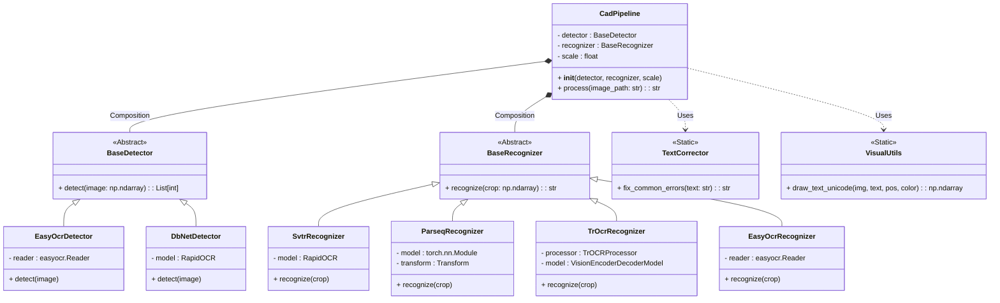
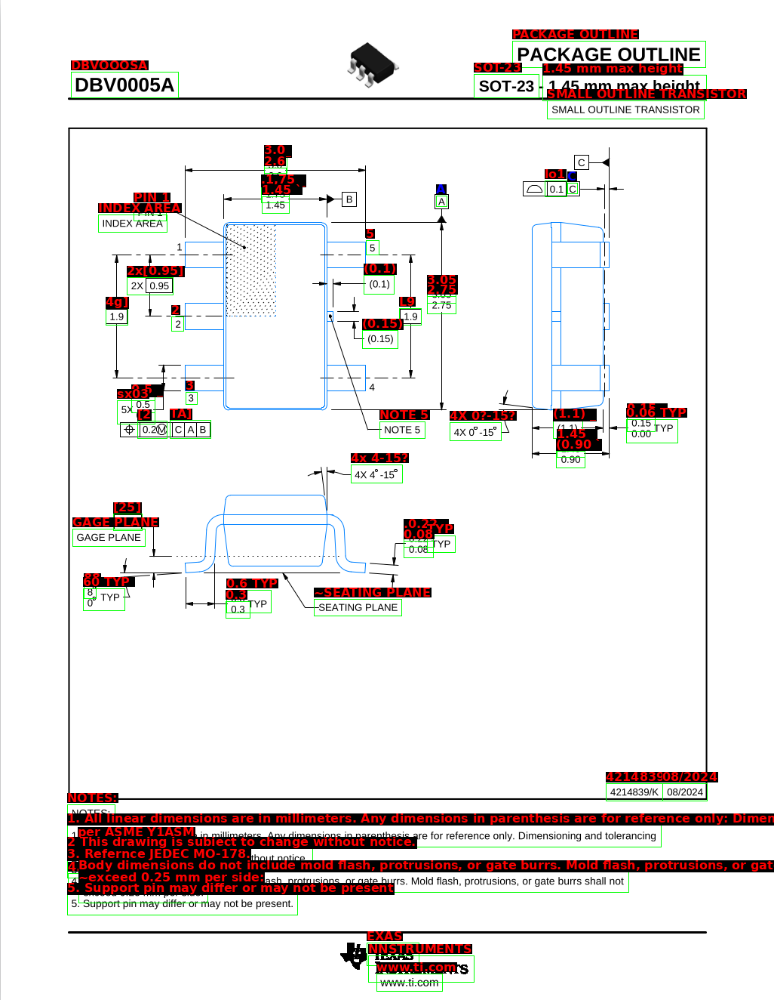
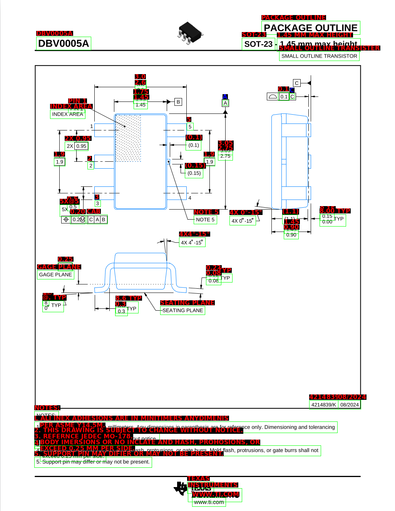
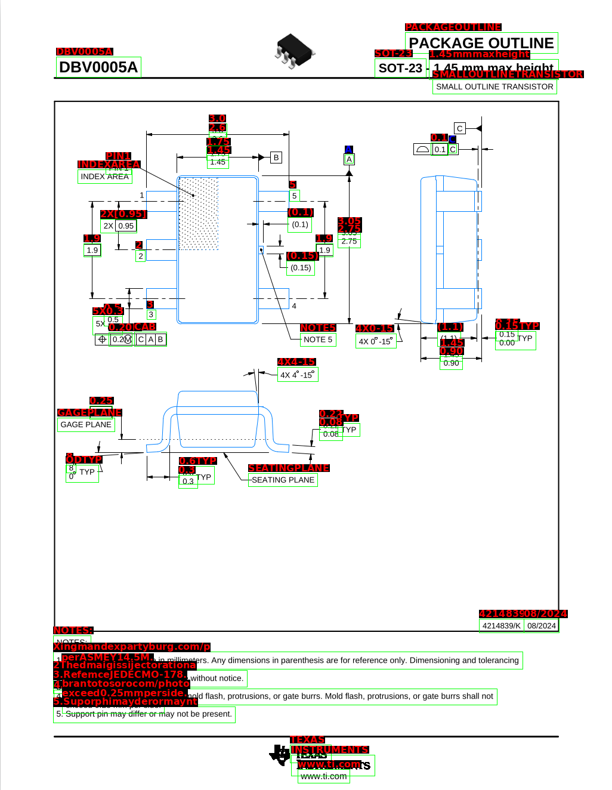
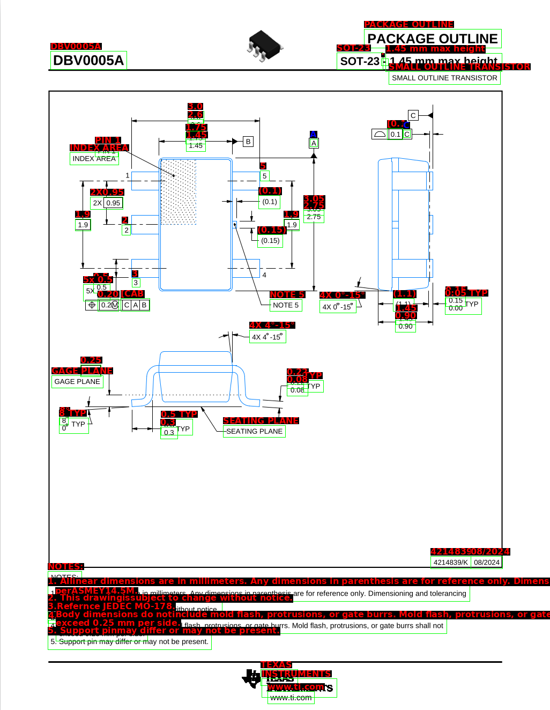
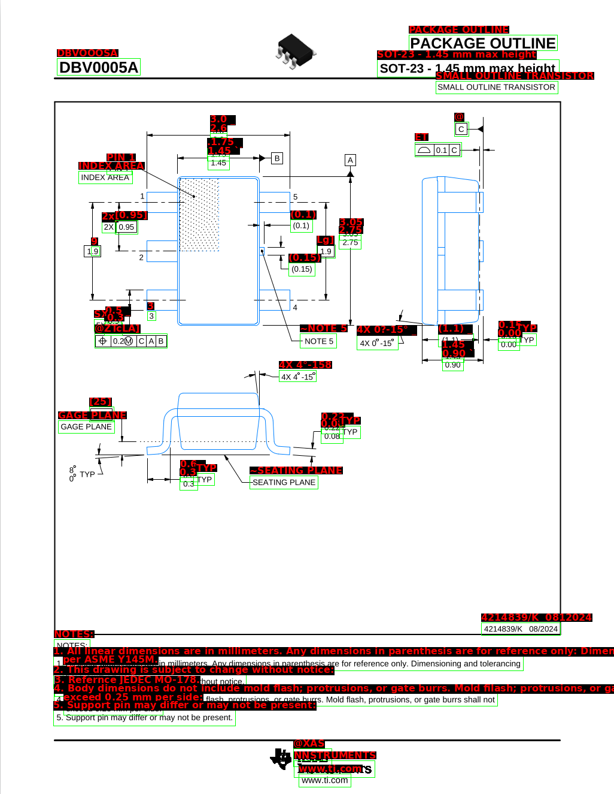
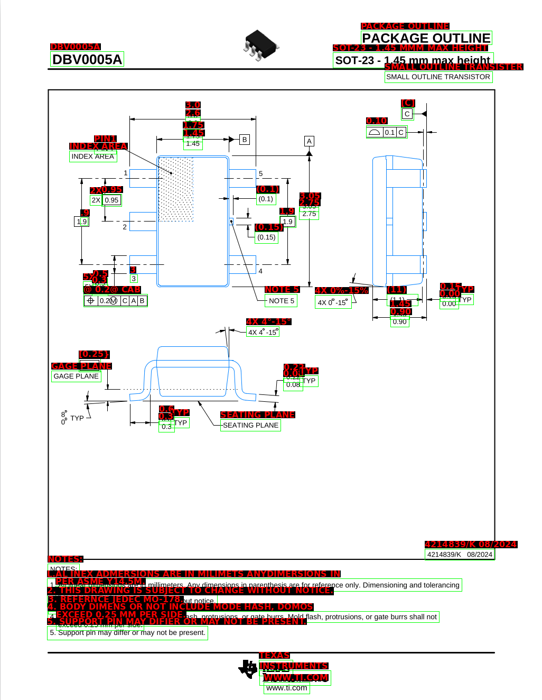
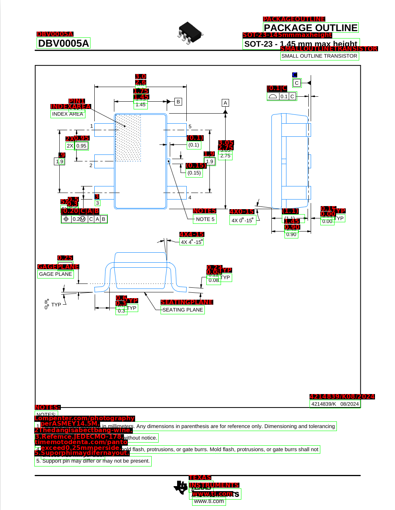

# PDF_manuel_extractor
Ce projet vise à mettre en place un prototype pour extraire les informations d'un document technique présentant un schéma avec des caractéristiques comme la marque, le nom du boitier, la hauteur, etc...

## Benchmark & Architecture Decision

Pour déterminer l'architecture optimale capable d'extraire des données techniques de plans CAO, nous avons réalisé un benchmark sur la config suivante :
* Ubuntu 24.04.3
* Ryzen 7 7700 (16) @ 5.392GHz
* AMD RX 6900 XT
* RAM DDR5 2*16GB 6000 MT/S

L'objectif était de trouver l'équilibre parfait entre **sensibilité de détection** (ne rater aucune cote) et **vitesse d'exécution**.

## Présentation des Architectures Testées

Afin de construire le pipeline d'extraction le plus performant, nous avons mis en compétition les architectures SOTA (*State of the Art*) actuelles. Voici les candidats :

### Les Détecteurs (Yeux)
*Leur rôle est de trouver les zones de texte dans l'image et de dessiner des boîtes autour.*

* **EasyOCR (CRAFT)** : Basé sur l'algorithme *Character Region Awareness for Text Detection*. Contrairement aux méthodes classiques qui cherchent des lignes entières, CRAFT détecte d'abord les caractères individuels puis évalue l'affinité entre eux. C'est une approche "Bottom-Up" très précise pour les espacements.
* **DBNet++ (RapidOCR)** : Une architecture de segmentation sémantique utilisant la *Differentiable Binarization*. Conçu pour la vitesse extrême, il traite l'image globalement pour séparer le fond du texte en une seule passe. C'est le standard industriel actuel pour la performance temps réel.

### Les Reconnaisseurs (Cervaux)
*Leur rôle est de décoder les pixels à l'intérieur d'une boîte pour en extraire le texte.*

* **SVTR (Single Visual Transformer)** : Un modèle inspiré des *Vision Transformers* (ViT) qui découpe l'image en petits patchs. Il analyse la séquence de manière parallèle (non-autorégressive), ce qui lui confère une vitesse de lecture fulgurante tout en étant robuste aux polices stylisées.
* **PARSeq (Permuted Autoregressive Sequence)** : Une approche novatrice qui apprend le contexte du langage via un mécanisme d'attention permuttée. Il est capable de "deviner" des caractères flous en utilisant le contexte bidirectionnel (ce qui est écrit avant et après).
* **TrOCR (Transformer OCR)** : Un modèle génératif de Microsoft basé sur une architecture *Encoder-Decoder* classique. Il fonctionne comme un traducteur qui "traduit" l'image en texte. Très précis mais structurellement lent car il génère le texte caractère par caractère.

### UML

## Résultats du Benchmark (SOT-23 Dataset)

| Detector (Localisation) | Recognizer (Lecture) | Temps (s) | Items Trouvés |
| :--- | :--- | :---: | :---: |
| **EasyOCR** | **SVTR** | **1.80s** | **61** |
| EasyOCR | Parseq | 2.00s | 60 |
| EasyOCR | TrOCR | 6.71s | 60 |
| EasyOCR | EasyOCR | 9.69s | 60 |
| DbNet++ | SVTR | 0.95s | 55 |
| DbNet++ | Parseq | 1.11s | 55 |
| DbNet++ | EasyOCR | 1.73s | 55 |
| DbNet++ | TrOCR | 5.52s | 55 |

---

### Analyse Technique Approfondie

#### Vitesse & Quantité

##### 1. Le choix du Détecteur : EasyOCR (CRAFT) vs DBNet++

Le benchmark révèle une différence critique de comportement entre les deux détecteurs : **EasyOCR détecte systématiquement ~10% d'éléments en plus (60 vs 55 items).**

* **Le problème de DBNet++ (Segmentation Sémantique) :**
    DBNet est conçu pour détecter des blocs de texte cohérents. Sur un plan technique dense, il a tendance à "fusionner" des éléments sémantiquement distincts s'ils sont physiquement proches.
    * *Exemple d'erreur :* Il fusionne le label `SOT-23` et la cote `1.45 mm` en un seul bloc : `"SOT-23 - 1.45mm"`.
    * *Conséquence :* Perte de la granularité de l'information.

* **La force d'EasyOCR (CRAFT - Character Region Awareness) :**
    EasyOCR travaille au niveau du caractère et de l'affinité entre eux. Il détecte les espaces vides, même minimes, entre les labels et les valeurs.
    * *Résultat :* Il sépare correctement `"SOT-23"` et `"1.45 mm"`.
    * *Verdict :* Pour la CAO, la séparation des données prime sur la vitesse pure. **EasyOCR est retenu.**

##### 2. Le choix du Reconnaisseur : SVTR vs PARSeq vs TrOCR

Une fois le texte localisé, il faut le lire. Trois architectures ont été testées :

* **TrOCR (Transformer Encoder-Decoder) :**
    * *Performance :* Très précis, c'est notre référence.
    * *Défaut :* Architecture auto-régressive (lit lettre par lettre). Avec **6.7s** et **5.52s** il est beaucoup plus lent que les autres reconnaisseurs.

* **PARSeq (Permuted Autoregressive Sequence) :**
    * *Performance :* Rapide (2.0s).
    * *Défaut :* Tendance à "halluciner" sur le jargon technique ou les textes flous. Dans nos tests, il a tendance à cancatener les mots aussi (`"Suporphimayder"` au lieu de `"Support pin may differ"`).

* **SVTR (Single Visual Transformer) :**
    * *Performance :* Le plus rapide (**1.8s**).
    * *Avantage :* Architecture non-auto-régressive (lecture parallèle). Il excelle sur les plans techniques.
    * *Sensibilité :* C'est le seul modèle à avoir détecté **61 items**, prouvant sa capacité à lire des micro-annotations que les autres ont lissées.

#### Qualité

##### EasyOCR + EasyOCR

##### EasyOCR + TrOCR

##### EasyOCR + Parseq

##### EasyOCR + SVTR

##### DBNet + EasyOCR

##### DBNet + TrOCR

##### DBNet + Parseq

##### DBNet + SVTR

Avec le Detecteur DBNet, cancatenation trop prématurer, ca créér du bruit pour les reconnaisseurs.
Des résultats interéssantes avec easyOCR comme detecteur :
* TrOCR arrive à se débouiller sur le plan et les notes en bas de pages avec des erreurs.
* SVTR lit parfaitement bien les notes en bas de pages mais se trompe sur quelque chiffres sur le plan quand c'est trop collé ensemble sur la verticale.
* Parseq reconnait très bien les chiffres du plan, à part le signe degré "°". Par contre, il est moins bon sur les phrases ou suite de mots.

## Conclusion & Limites

Ce prototype démontre des résultats très prometteurs avec une architecture hybride **Décodeur + Reconnaisseur**.

Cependant, nous atteignons les limites des modèles pré-entraînés :
1.  **Caractères Spéciaux :** La gestion des symboles mathématiques (°, Ø, ±) reste aléatoire.
2.  **Chiffres :** La tolérances verticales, la reconnaissance perd en fiabilité lorsque des chiffres sont empilés verticalement (listes de cotes). Cette densité provoque des confusions fréquentes entre des chiffres morphologiquement proches (ex: le '3' lu comme un '5').

**Prochaine étape :** Pour passer de 90% à 99.9% de précision, l'utilisation de modèles génériques ne suffit plus. Il sera nécessaire de procéder à un **Fine-Tuning** (Transfer Learning) sur un dataset spécifique de plans techniques annotés. Généraliser sur d'autres plan plus complexe (plus riche en information).
